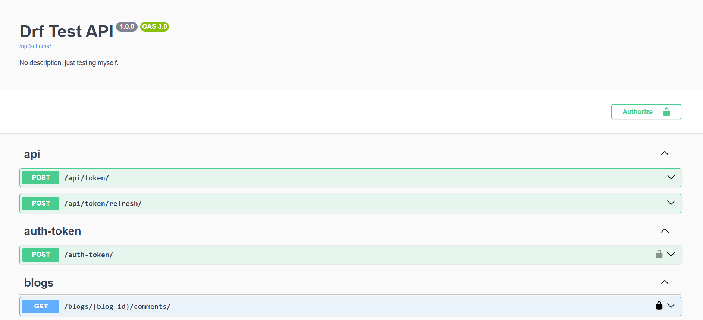

# 📝 Django REST Blog API

A complete Blog REST API built with Django REST Framework featuring user authentication, post and comment management, filtering, pagination, and interactive API documentation with Swagger.

---

## 🚀 Features

- User registration and authentication (Token or JWT)
- Authenticated users can create blog posts
- Only post owners can edit or delete their posts
- Draft/Published post status
- Public access to published posts
- Commenting system restricted to logged-in users
- Only comment authors can edit or delete their comments
- Filter posts by author or publish status
- Pagination support (PageNumber and LimitOffset)
- Swagger/OpenAPI auto-generated documentation

---

## 🛠️ Tech Stack

- **Python 3.10+**
- **Django 4.x**
- **Django REST Framework**
- **Simple JWT / Token Authentication**
- **drf_spectacular (Swagger UI)**
- **SQLite** or **PostgreSQL**
- **Docker (optional)**

---

---

## 🛠️ Screenshots

### 🗂️ Swagger


### 📄 Some Changes By Swagger


### 📱 Rest Framework UI


### 📰 JWT Authentication


---

## ▶️ Getting Started

1. **Clone the repository**:

```bash
git clone https://github.com/YourUsername/your-project-name.git
cd your-project-name
